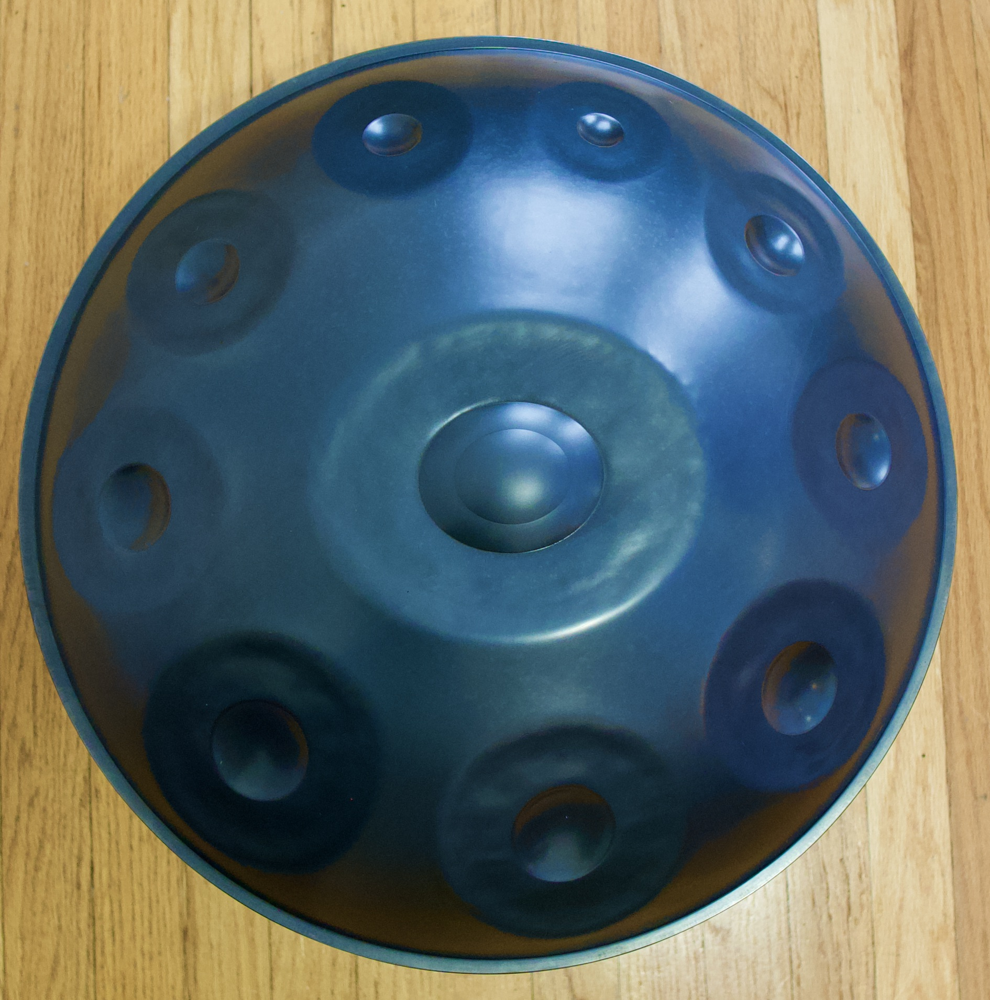

# Pan Game

## Date:11/17/2021

### By: Josh Rea

##### [Github](https://github.com/jdrea1587) | [LinkedIn](https://www.linkedin.com/in/joshua-rea-178a1722/)
***
***Description***
##### Ever wanted to test out a handpan and see if the scale is for you? This app allows you to test a scale, play around a little and play a game that tests your memory like 'simon says'. For this project the only scale will be the kurd 9: 
(D) A, Bb, C, D, E, F, G, A, C
***
***Task Lists***
- [ ] Medium Level with timer
- [ ] Pan Hero
***
***Screenshots***
Ayasa Guana Kurd 9

***
***Credits***
HTML SVG code adapted from Marco Andrea Zappani's HaganeNote Page:
https://www.haganenote.com/vst/handpan-virtual-instrument.html

